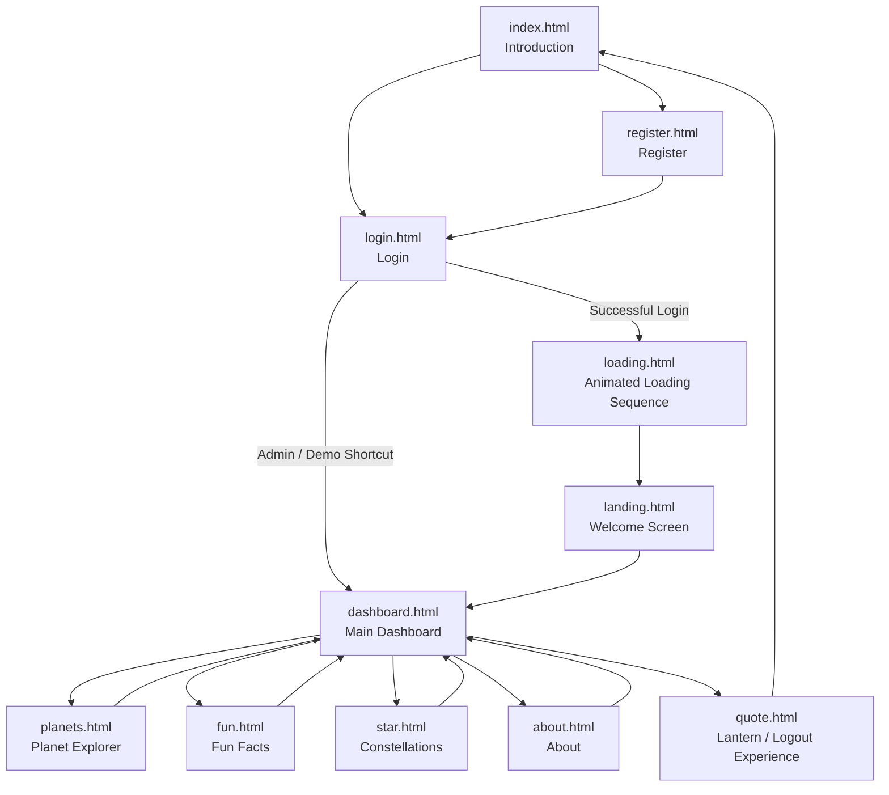
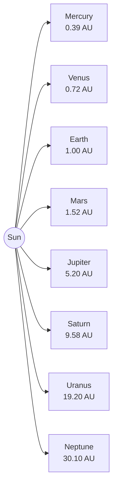
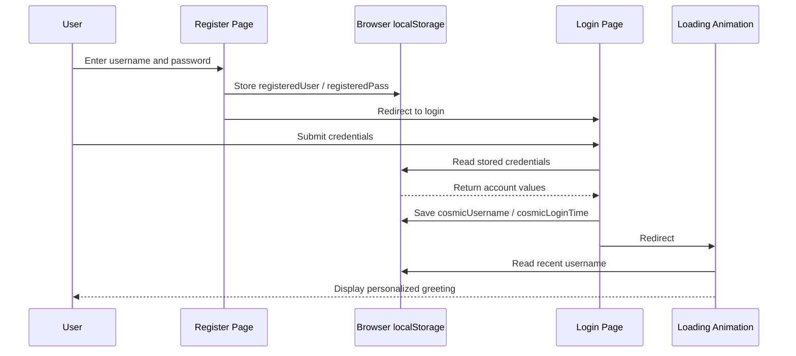
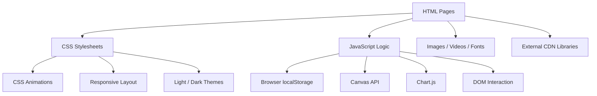

<div align="center">


# AXN Solar System Explorer

### Interactive Web-Based Solar System Learning Experience

An interactive educational website developed with **HTML5, CSS3, JavaScript, Bootstrap, Chart.js, Canvas animations, and browser localStorage**.  
AXN Solar System Explorer combines planetary information, animated visualizations, constellation learning, fun facts, interactive charts, and a creative space-themed user experience in a single front-end web application.


</div>

---

# Project Overview

**AXN Solar System Explorer** is a space-themed educational web application designed to make Solar System information more engaging through interactive interfaces, animation, visual storytelling, and data visualization.

Instead of presenting astronomy information as plain text, the website combines:

- animated planetary motion;
- interactive planet cards;
- planetary comparison charts;
- constellation diagrams;
- educational timelines;
- rotating astronomy facts;
- browser-based registration and login;
- personalized welcome messages;
- light/dark visual themes;
- animated starfields;
- multimedia backgrounds; and
- a creative lantern-message experience.

The project is implemented entirely on the **front end**. It does not require a database server. User registration and login information used by the demonstration flow is stored in the browser through the JavaScript `localStorage` API.

From an **Information Systems Management** perspective, the project demonstrates how information can be organized, visualized, navigated, and presented through an interactive information interface.

---

# Project Objectives

The AXN Solar System Explorer was designed to:

1. Provide an engaging digital platform for learning about the Solar System.
2. Present planetary information through visual and interactive interfaces.
3. Allow users to compare planetary characteristics through charts and infographics.
4. Introduce major constellations and their identifying stars, shapes, and mythology.
5. Present astronomy facts through an interactive content-reveal mechanism.
6. Demonstrate browser-based registration and login interaction.
7. Create a personalized experience using browser session information.
8. Apply responsive web design for different screen sizes.
9. Integrate multimedia, animation, charts, and interactive JavaScript into a unified website.
10. Demonstrate front-end information-system design and user-experience concepts.

---

# System Highlights

The project includes:

- **12 HTML pages**
- **8 custom CSS stylesheets**
- **6 JavaScript files**
- Custom **Syncopate** fonts
- High-resolution planet imagery
- Animated Sun video
- Space-themed login video
- Responsive Bootstrap navigation
- Interactive Canvas starfields
- Animated dark/light mode control
- Comet-trail theme animation
- Planet size bubble chart
- Planet temperature bar chart
- Habitability comparison chart
- Solar System distance infographic
- Interactive planet orbit model
- 12-constellation learning section
- 12 rotating astronomy facts
- Solar System historical timeline
- Browser-based registration/login flow
- Personalized greeting logic
- Creative message-lantern interaction
- Responsive layouts for desktop, tablet, and mobile

---

# Application Flow



---

# Pages and Modules

## 1. Home / Introduction

**File:** `index.html`

The main entry page introduces the **AXN Solar System Explorer** brand.

### Main Elements

- AXN logo text
- Space-themed hero section
- Earth visual
- Introductory tagline
- **Discover Now** button
- Registration button
- Navigation links
- Responsive hamburger navigation

### Navigation

The introduction page guides users toward:

- Dashboard/Login
- Explore/Login
- Constellation/Login
- About/Login
- Registration

The mobile menu is controlled by a small JavaScript event that toggles the menu visibility.

---

## 2. Registration

**File:** `register.html`

The registration page provides a simple browser-based account creation process.

### Registration Fields

- Username
- Password

### Registration Process

When the user submits the form:

1. JavaScript prevents the normal form submission.
2. Username and password fields are validated.
3. The credentials are stored in browser `localStorage`.
4. A registration-success message is displayed.
5. The user is automatically redirected to the login page.

The stored keys are:

```text
registeredUser
registeredPass
```

This enables the project to demonstrate account registration without requiring a backend or database.

---

## 3. Login

**File:** `login.html`

The login interface uses a looping space video as its background.

### Features

- Username input
- Password input
- Login button
- Admin/demo access button
- Error-message area
- Video background
- Custom login-card interface

### Login Logic

Authentication is handled in:

```text
js/script.js
```

The system supports:

- a built-in demonstration account; and
- an account created through `register.html`.

When authentication is successful, the browser stores:

```text
cosmicUsername
cosmicLoginTime
```

The user is then redirected to the Welcome Screen.

### Personalized Greeting

The page reads the recent login data from:

```text
cosmicUsername
cosmicLoginTime
```

## 5. Welcome / Landing Screen

**File:** `landing.html`

The landing page provides a short introduction to the purpose of the system before opening the dashboard.

### Content

- AXN logo
- Welcome heading
- Description of the interactive Solar System application
- Full-screen space image
- Glass-style popup panel
- Animated star overlay
- Glowing **NEXT** button

Selecting **NEXT** opens:

```text
dashboard.html
```

---

## 6. Dashboard

**File:** `dashboard.html`  
**Styles:** `css/dashboard.css`  
**Logic:** `js/dashboard.js`

The dashboard provides a visual overview of Solar System information.

### Dashboard Sections

#### Planet Size Comparison

A Chart.js **bubble chart** presents all eight planets using differently sized and colored bubbles.

Planets included:

- Mercury
- Venus
- Earth
- Mars
- Jupiter
- Saturn
- Uranus
- Neptune

The chart provides interactive tooltips for size comparison.

---

### Summary Cards

Three information cards summarize:

| Information | Value |
|---|---|
| Total Planets | 8 |
| Total Moons | 200+ |
| Solar System Location | The Milky Way |

---

### Planet Temperature Comparison

A Chart.js **bar chart** compares approximate planetary surface/atmospheric temperature values used by the project:

| Planet | Temperature |
|---|---:|
| Mercury | 167 °C |
| Venus | 464 °C |
| Earth | 15 °C |
| Mars | -65 °C |
| Jupiter | -110 °C |
| Saturn | -140 °C |
| Uranus | -195 °C |
| Neptune | -200 °C |

---

### Planet Motion Overview

The dashboard also contains a CSS-based orbit animation featuring:

- central Sun;
- three orbit paths; and
- animated planets moving at different speeds.

This provides a simplified visual representation of orbital motion.

---

### Space Event Ticker

A horizontally animated event section cycles through curated astronomy-themed event messages.

Examples include:

- satellite launches;
- lunar eclipses;
- comet observations;
- James Webb Space Telescope discoveries; and
- Milky Way imaging.

The JavaScript periodically rotates the displayed event text.

---

## 7. Planet Explorer

**File:** `planets.html`  
**Styles:** `css/planets.css`  
**Shared Logic:** `js/script.js`

The Planet Explorer is one of the main educational areas of the website.

It combines a planet-name interface with an animated Solar System model.

### Inner Planets

- Mercury
- Venus
- Earth
- Mars

### Outer Planets

- Jupiter
- Saturn
- Uranus
- Neptune

### Interactive Behaviour

Users can:

- hover over a planet name;
- display its information card;
- visually highlight the corresponding orbit;
- click a planet to retain its highlighted state; and
- click outside the planet interface to clear the active selection.

### Animated Solar System

The center of the page contains:

- a looping Sun video;
- eight orbit paths;
- planet image assets; and
- CSS orbital animation.

Each orbit uses a `data-planet` identifier to connect the visual planet with the corresponding information item.

---

### Planet Information

Each planet includes a short educational profile.

| Planet | Diameter | Distance | Highlight |
|---|---:|---:|---|
| Mercury | 4,879 km | 0.39 AU | Smallest planet |
| Venus | 12,104 km | 0.72 AU | Hottest planet |
| Earth | 12,742 km | 1 AU | Only known world with life |
| Mars | 6,779 km | 1.52 AU | Red Planet |
| Jupiter | 139,820 km | 5.2 AU | Largest planet |
| Saturn | 116,460 km | 9.58 AU | Famous ring system |
| Uranus | 50,724 km | 19.2 AU | Rotates on its side |
| Neptune | 49,244 km | 30.05 AU | Extremely fast winds |

---

### Distance from the Sun Infographic

The page contains an animated bar-style comparison of average planetary distance from the Sun.

Values are displayed in **Astronomical Units (AU)**:

```text
Mercury   0.39 AU
Venus     0.72 AU
Earth     1.00 AU
Mars      1.52 AU
Jupiter   5.20 AU
Saturn    9.58 AU
Uranus   19.20 AU
Neptune  30.10 AU
```

---

## 8. Fun Facts & Habitability

**File:** `fun.html`  
**Styles:** `css/fun.css`  
**Logic:** `js/funfact.js`

The Fun Facts page combines astronomy trivia, habitability visualization, and a historical timeline.

### Interactive Fun Fact Generator

Selecting **Reveal Fact** cycles through a set of 12 astronomy facts.

The interface includes a fact counter:

```text
Fact #X / 12
```

---

### Planet Habitability Chart

Chart.js is used to visualize comparative habitability scores for the eight planets.

The chart emphasizes Earth's environmental suitability while illustrating the more extreme conditions on other planets.

The page also provides an explanatory text summary discussing:

- temperature;
- atmosphere;
- liquid water;
- surface conditions;
- gas giant environments; and
- potential space-exploration considerations.

---

### Solar System Timeline

The page contains a visual historical timeline.

| Period | Event |
|---|---|
| 4.6 billion years ago | Solar System forms from a collapsing nebula |
| 4.5 billion years ago | Theia-Earth collision and formation of the Moon |
| 3.8 billion years ago | Late Heavy Bombardment |
| 1992 | First exoplanet discovery |
| Today / 2025 | Modern Solar System exploration |

---

## 9. Constellation Explorer

**File:** `star.html`  
**Styles:** `css/star.css`

The Constellation Explorer presents 12 recognizable constellations using custom SVG star patterns and educational information cards.

### Constellations Included

1. Orion
2. Ursa Major
3. Cassiopeia
4. Scorpius
5. Leo
6. Taurus
7. Cygnus
8. Lyra
9. Aquila
10. Pegasus
11. Andromeda
12. Perseus

### Information Presented

Depending on the constellation, cards provide:

- major bright stars;
- recognizable shape or feature; and
- associated mythology.

Examples:

| Constellation | Highlight |
|---|---|
| Orion | Betelgeuse, Rigel, Orion's Belt |
| Ursa Major | Dubhe, Merak, Big Dipper |
| Cassiopeia | Schedar, Caph, W-shaped pattern |
| Scorpius | Antares, J-shaped tail |
| Leo | Regulus |
| Taurus | Aldebaran, Hyades |
| Cygnus | Deneb, Northern Cross |
| Lyra | Vega |
| Aquila | Altair |
| Pegasus | Great Square |
| Andromeda | Chained-princess mythology |
| Perseus | Mirfak, Medusa mythology |

### Visual Behaviour

The constellation page uses:

- SVG star diagrams;
- glowing star styling;
- different star intensities;
- twinkling animations;
- red-star animations for selected stars;
- responsive constellation cards; and
- space-themed background styling.

---

## 10. Lantern Message Experience

**File:** `quote.html`  
**Styles:** `css/quote.css`  
**Logic:** `js/quote.js`

The logout area is designed as an interactive **Cast Your Lantern** experience rather than a simple exit screen.

### User Interaction

Users can:

1. enter a message of up to 140 characters;
2. select **Release the Lantern**;
3. watch the message transform into an animated lantern;
4. watch the lantern travel across the screen; and
5. click floating lanterns to reveal messages.

### Background Lanterns

The page automatically creates floating lanterns containing predefined inspirational or space-themed messages.

A maximum number of lanterns is maintained on screen.

### Message Rendering

When a lantern is selected:

- a Canvas layer is created;
- the message appears above the lantern;
- text receives a glowing effect;
- long messages are automatically wrapped; and
- the message fades after a short period.

### Logout

The **Logout** button returns the user to:

```text
index.html
```

---

## 11. About Page

**File:** `about.html`  
**Styles:** `css/about.css`  
**Logic:** `js/about.js`

The About page explains the concept and purpose of AXN Solar System Explorer.

### Mission

To provide an interactive journey through the Solar System and make planetary exploration accessible through a digital experience.

### Vision

To encourage curiosity about the universe and inspire future generations of explorers.

### Objectives

The page presents three central objectives:

#### Educate
Provide scientific and planetary information.

#### Visualize
Present Solar System information through engaging visual media.

#### Inspire
Encourage curiosity and interest in space exploration.

### Page Effects

- animated Canvas starfield;
- fade-in content;
- sequential element reveals;
- Font Awesome icons;
- custom typography;
- dark/light theme switch; and
- comet-trail theme animation.

---

# Dashboard Visualizations

The application uses charting and visual elements to turn astronomical information into understandable comparisons.

## 1. Planet Size Bubble Chart

```text
Chart Type: Bubble
Library: Chart.js
Purpose: Visual comparison of planet sizes
```

Each planet uses a different bubble radius and color.

---

## 2. Planet Temperature Bar Chart

```text
Chart Type: Bar
Library: Chart.js
Purpose: Compare approximate planetary temperatures
```

---

## 3. Planet Habitability Bar Chart

```text
Chart Type: Bar
Library: Chart.js
Purpose: Compare educational habitability scores
```

---

## 4. Distance from Sun Infographic

```text
Visualization: CSS animated bars
Unit: Astronomical Unit (AU)
Purpose: Compare average orbital distance
```

---

## 5. Orbital Motion

```text
Visualization: CSS keyframe animation
Purpose: Demonstrate relative circular orbital movement
```

---

# Planetary Data

The project contains educational data for all eight recognized planets.



The project uses these values across:

- planet information cards;
- orbital visuals;
- distance bars;
- size comparison;
- temperature comparison; and
- habitability visualization.

---

# Constellation Content

The constellation module uses HTML and SVG to represent recognizable star patterns.

```text
Orion
Ursa Major
Cassiopeia
Scorpius
Leo
Taurus
Cygnus
Lyra
Aquila
Pegasus
Andromeda
Perseus
```

SVG line-and-circle diagrams allow the website to illustrate constellation patterns directly in the browser without requiring a separate image for every constellation.

---

# Browser-Based User Flow

AXN uses the browser's `localStorage` API for demonstration account handling.

## Registration Storage

```text
registeredUser
registeredPass
```

## Successful Login State

```text
cosmicUsername
cosmicLoginTime
```

## Flow



No MySQL, Firebase, PHP, Node.js, or other database/backend service is required to demonstrate this workflow.

---

# Technology Stack

## Core Front-End

| Technology | Purpose |
|---|---|
| **HTML5** | Page structure and content |
| **CSS3** | Layout, visual design, responsive styling, animations |
| **JavaScript (Vanilla JS)** | Interaction, forms, charts, state, Canvas animation |
| **Bootstrap 5.3** | Responsive navbar and layout utilities |
| **Browser localStorage** | Demonstration account and login state |

---

## Visualization & UI Libraries

| Technology | Purpose |
|---|---|
| **Chart.js** | Bubble and bar charts |
| **ApexCharts** | Visualization library included on the Fun Facts page |
| **Font Awesome** | Icons on the About page |
| **Popper.js** | Supporting Bootstrap-style positioning |
| **Google Fonts** | Orbitron and Exo 2 typography |
| **Canvas API** | Starfields and glowing lantern messages |
| **SVG** | Constellation diagrams |

---

## Local Assets

The project also includes:

- `Syncopate-Regular.ttf`
- `Syncopate-Bold.ttf`
- high-resolution planet PNG files;
- space background JPEG files;
- AXN logo imagery;
- lantern imagery;
- astronomy-themed decorative graphics;
- login background video; and
- animated Sun video.

---

# Front-End Architecture

The system follows a multi-page front-end structure.



---

# JavaScript Functionality

The project contains six JavaScript source files.

## `js/script.js`

Shared interaction logic used across several pages.

### Responsibilities

- login processing;
- built-in demo login;
- reading registered credentials from localStorage;
- login-state storage;
- admin/demo redirect;
- Canvas starfield generation;
- planet hover interaction;
- planet orbit highlighting;
- active planet selection;
- click-outside reset;
- dark/light theme switching;
- animated comet-trail particles;
- planet temperature chart configuration;
- curated space-event content;
- logout navigation.

---

## `js/dashboard.js`

Dedicated dashboard functionality.

### Responsibilities

- dashboard starfield animation;
- responsive Canvas resizing;
- dark/light theme handling;
- comet-trail animation;
- rotating event text;
- Chart.js planet-size bubble chart;
- Chart.js temperature bar chart.

---

## `js/about.js`

About-page animation and theme logic.

### Responsibilities

- 3D-style moving starfield;
- 150 animated stars;
- window resize handling;
- sequential content reveal;
- dark/light mode;
- sun/moon icon switching;
- comet-trail particles.

---

## `js/funfact.js`

Fun Facts and habitability visualization logic.

### Responsibilities

- stores 12 astronomy facts;
- cycles through facts;
- updates fact counter;
- fade transition for facts;
- planet color definitions;
- Chart.js habitability visualization;
- custom chart summary rendering.

---

## `js/quote.js`

Lantern interaction engine.

### Responsibilities

- predefined explorer messages;
- lantern generation;
- user-message lantern creation;
- message wrapping;
- animated message card;
- lantern flight animation;
- Canvas message rendering;
- glowing text;
- background lantern generation;
- timed cleanup.

---

## `js/planet.js`

Planet-distance chart configuration.

### Data Included

```text
Mercury   0.39 AU
Venus     0.72 AU
Earth     1.00 AU
Mars      1.52 AU
Jupiter   5.20 AU
Saturn    9.58 AU
Uranus   19.20 AU
Neptune  30.05 AU
```

The file defines a Chart.js bar-chart representation of planetary distance.

---

# Styling & Visual Design

The project contains eight dedicated CSS files.

| Stylesheet | Main Responsibility |
|---|---|
| `css/intro.css` | Home page and introductory hero |
| `css/login.css` | Login and registration interfaces |
| `css/dashboard.css` | Dashboard, navbar, cards, charts, themes |
| `css/planets.css` | Planet explorer, orbits, data cards, distance bars |
| `css/fun.css` | Fun-fact cards, habitability section, timeline |
| `css/star.css` | Constellation cards, SVG stars, twinkling animations |
| `css/about.css` | About content, theme effects, animations |
| `css/quote.css` | Lantern-message interface |

---

## Visual Design Techniques

The CSS uses:

- gradients;
- glowing shadows;
- backdrop blur;
- glassmorphism;
- animated star backgrounds;
- CSS orbit animations;
- hover scaling;
- fade-in effects;
- responsive grids;
- animated event scrolling;
- animated graph bars;
- twinkling stars;
- custom scrollbars;
- card hover effects;
- theme overlays;
- responsive navbar behaviour.

---

## Custom Font

The site includes its own local **Syncopate** font files:

```text
font/Syncopate-Regular.ttf
font/Syncopate-Bold.ttf
```

These are used especially in navigation and title areas to reinforce the futuristic space aesthetic.

---

# Responsive Design

The project contains multiple CSS media-query breakpoints to adapt the interface for smaller screens.

Responsive behaviour includes:

- collapsing Bootstrap navigation;
- mobile hamburger controls;
- stacked dashboard columns;
- resized chart canvases;
- smaller orbit models;
- adjusted planet cards;
- repositioned planet information panels;
- mobile constellation layouts;
- reduced spacing;
- scalable headings;
- responsive footer layouts; and
- mobile-friendly content widths.

The design is primarily optimized around the project's stated target presentation environment:

```text
Google Chrome
1920 × 1080
```

while still including responsive styling for smaller displays.

---

# Project Structure

```text
IMS566-SOLARSYSTEM/
│
├── .vscode/
│   └── launch.json
│
├── css/
│   ├── about.css
│   ├── dashboard.css
│   ├── fun.css
│   ├── intro.css
│   ├── login.css
│   ├── planets.css
│   ├── quote.css
│   └── star.css
│
├── font/
│   ├── Syncopate-Bold.ttf
│   └── Syncopate-Regular.ttf
│
├── images/
│   ├── Planet/
│   ├── astronout.png
│   ├── bg.jpg
│   ├── bg2.jpg
│   ├── earth.png
│   ├── earth1.png
│   ├── favicon.ico
│   ├── globe.png
│   ├── img1.jpg
│   ├── img2.jpg
│   ├── img4.jpg
│   ├── img6.jpg
│   ├── img9.jpg
│   ├── intro.jpeg
│   ├── jupiter.png
│   ├── lantern.png
│   ├── logo.jpeg
│   ├── mars.png
│   ├── mercury.png
│   ├── neptune.png
│   ├── saturn.png
│   ├── star.png
│   ├── uranus.png
│   └── venus.png
│
├── js/
│   ├── about.js
│   ├── dashboard.js
│   ├── funfact.js
│   ├── planet.js
│   ├── quote.js
│   └── script.js
│
├── videos/
│   ├── login.mp4
│   └── sun.webm
│
├── about.html
├── dashboard.html
├── fun.html
├── index.html
├── landing.html
├── loading.html
├── login.html
├── navbar.html
├── planets.html
├── quote.html
├── register.html
└── star.html
```

---

# External Libraries & Resources

Several pages load libraries through public CDNs.

### Bootstrap

```text
Bootstrap 5.3.2
Bootstrap 5.3.3
```

Used for:

- responsive navigation;
- grid layouts;
- cards;
- dropdowns;
- utility classes; and
- responsive components.

### Chart.js

Used for:

- planet-size visualization;
- temperature comparison; and
- habitability comparison.

### ApexCharts

Included on the Fun Facts page as a visualization library.

### Font Awesome

Used for icons such as:

- education;
- visualization; and
- exploration objectives.

### Google Fonts

Fonts loaded include:

- Orbitron
- Exo 2

### Popper.js

Included as a supporting positioning library on the constellation page.

An internet connection is recommended when running the project so CDN-hosted libraries and online font resources can load correctly.

---

# How to Run the Project

AXN Solar System Explorer is a **static front-end project**.

You do **not** need:

```text
MySQL
MariaDB
PHP
Laravel
CakePHP
Node.js backend
Firebase
XAMPP database
Laragon database
```

The correct flow is:

```text
Project Files
    ↓
Start Live Server / Python HTTP Server
    ↓
localhost begins listening
    ↓
Browser connects
    ↓
index.html loads
```

A database connection is not involved.

---

# Demo Login

The project includes a built-in demonstration account:

```text
Username: user
Password: 1234
```

You can also create a browser-based account through:

```text
register.html
```

and then use that username and password on the login page.

---

# How to Use the Website

## Standard User Journey

1. Open `index.html`.
2. Select **Register** to create a browser-based account, or select **Discover Now**.
3. Log in using your credentials.
4. Watch the animated Solar System loading sequence.
5. Continue through the welcome screen.
6. Open the Dashboard.
7. Review planet-size and temperature visualizations.
8. Use **Explore → Planets** to open the interactive planet model.
9. Hover over planet names to view details.
10. Use **Explore → Fun Facts** to reveal astronomy facts.
11. Review the habitability comparison.
12. Explore the Solar System historical timeline.
13. Open **Constellation** to study 12 star patterns.
14. Open **About** to review the mission, vision, and objectives.
15. Open **Logout** to enter the lantern-message page.
16. Write and release a lantern message if desired.
17. Select **Logout** to return to the main introduction page.

---

# Information Systems Management Skills Demonstrated
## Information Architecture

- structured navigation;
- logical separation of information pages;
- educational content organization;
- dashboard information grouping;
- category-based information presentation.

---

## User Interface & User Experience

- responsive navigation;
- interactive content;
- visual feedback;
- animated transitions;
- user onboarding;
- theme controls;
- dashboard design;
- information cards;
- multimedia presentation.

---

## Data Visualization

- bubble charts;
- bar charts;
- comparative planetary data;
- information summaries;
- infographic-style distance presentation;
- educational timeline.

---

## Front-End Development

- semantic HTML structure;
- custom CSS;
- JavaScript event handling;
- DOM manipulation;
- browser storage;
- responsive Bootstrap components;
- Canvas graphics;
- SVG diagrams;
- multimedia integration.

---

## Browser State Management

- browser-based account registration;
- localStorage credential retrieval;
- session-style login timestamp;
- personalized welcome messages.

---

## Interactive System Design

- multi-page information flow;
- hover interaction;
- click selection;
- animated navigation;
- dynamic facts;
- user-generated lantern messages;
- automatic content rotation.

---

## Multimedia Information Presentation

- high-resolution imagery;
- looping video backgrounds;
- animated Sun;
- custom fonts;
- graphical constellations;
- visual theme effects.

---

# Project Credits

### Syazwan Aqim  
### Ahmad Naqiu Dinie

Project footer information:

```text
Created in December 2025
Target Browser: Google Chrome
Target Resolution: 1920 × 1080
```

---

<div align="center">

## AXN Solar System Explorer

**Explore the planets. Discover the constellations. Experience the cosmos.**

Built as an interactive **IMS566 / Information Systems Management student web project** using HTML, CSS, JavaScript, Bootstrap, Chart.js, Canvas, SVG, multimedia assets, and browser storage.

</div>
